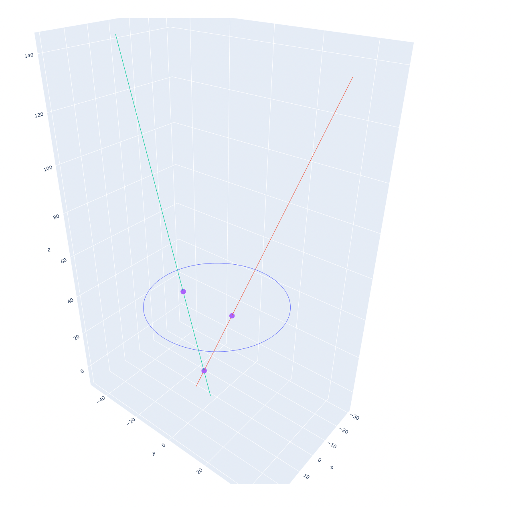

**System Overview:**
The [Arducam board](https://www.arducam.com/product/arducam-12mp2-synchronized-stereo-camera-bundle-kit-for-raspberry-pi-two-12-3mp-imx477-camera-modules-with-cs-lens-and-arducam-camarray-stereo-camera-hat/) takes multiple camera images and stitches them into one picture. This is important as it ensures that the inputs from each camera are syncronized. These images are then passed to the computer via an [hdmi capture device](https://www.amazon.com/dp/B08BJY699K/?ref=idea_lv_dp_vv_d) (the computer treats this input as a webcam). The python code is meant to process frames from this setup, but does not specify how the input is received. This allows for input from a video or in real time from the camera input.

**Hardware Design:**
The design of the hardware should be such that eac camera can see all 4 fiducials. The cameras can be at any angle and distance from the faceplate so long as this requirement is met.

**Receiving video from raspberry pi:**

In this system all the raspberry pi does is receive video from the hat and then send it to the pc. This is done via 
the hdmi port. Upon being turned on, the raspberry pi runs a script which fills the display with the camera output.
Instructions on how to set this up this can be found [here](https://webtechie.be/post/2021-12-20-raspberry-pi-as-hdmi-camera-for-atem-mini/)

One important thing to note is that the pi outputs at a 16:9 aspect ratio while the camera outputs at a 4:3 aspect 
ratio. While it is possible to fill the entire screen with the camera, this will cut off the top and bottom of the 
image. The best solution I found is to match the vertical resolutions and have black bars on either side. The camera 
output resolution can be changed by modifying the lib camera hello command in the startup script

Setting up the object localization software with a new hardware configuration (these steps only need to be performed once):

1. Run the findCameraIntrensics.py script. Place a 7x7 chessboard cutout beneath each camera, then press enter. The program will then attempt to find the chessboard corners for each camera. The program will then print if each camera was successful. Try to get at least 40 successful images per camera. More info about this calibration process can be found [here](https://www.geeksforgeeks.org/camera-calibration-with-python-opencv/),
2. Place the calibration plate inside the lev, then call the calibrate_focal_points method with an object localizer class. this will calculate the focal points of each camera with a given hardware setup

**Running the object localization software:**

After calibration the user should only need to interact with the object_localizer class. Each call to localize object 
inputs a raw frame from the pi and outputs the 3d coordinates of the object in millimeters. If no objects are found then None is returned

**Overview of main algorithm used during localization:**

Assume 1 object is in the levitator. Using open-cvs find contour method we ae able to find the location of the projection 
of the object on the fiducial plane. We can then draw a vector from the cameras focal point to the location of the 
projection. The object is then located Where these two lines are closest to each other. 

Here is an example output from running the localize_object method with debug enabled:

Because there is no threshold value that will work for every background and object combination, different thresholds are 
tried until the object is detected. For each threshold value we receive a set of contours from each camera. We then check 
every combination of contours and if the lines come close enough to each other than an object is detected. To limit the 
amount of contours detected per threshold image, filters are applied. By default, we filter by size and circularity. 
These filters are not meant to eliminate every contour which does not correspond to an object, but only those which are 
obviously wrong to help runtime.

